# Week 1

homework 1

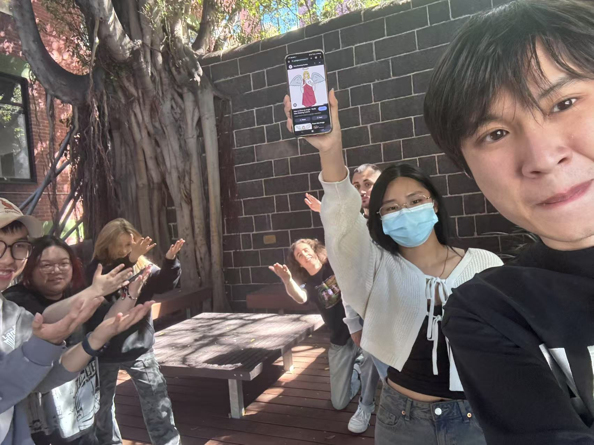
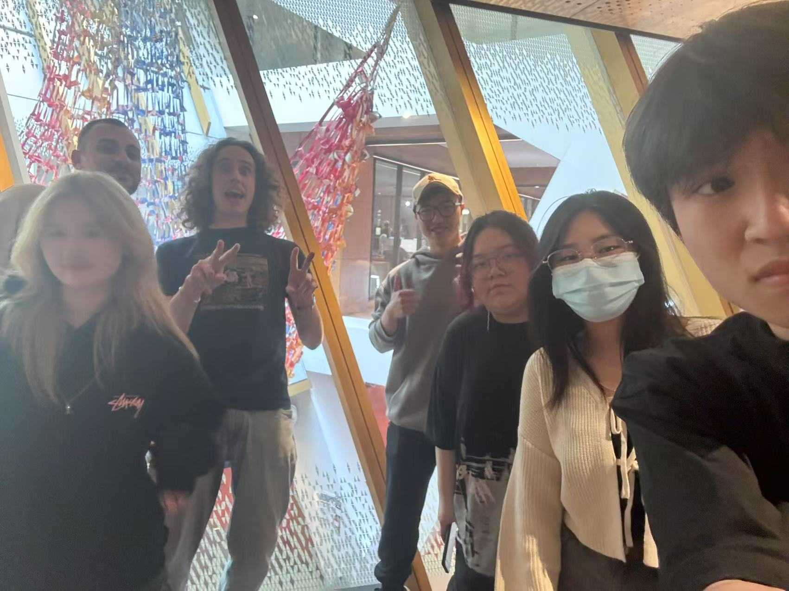
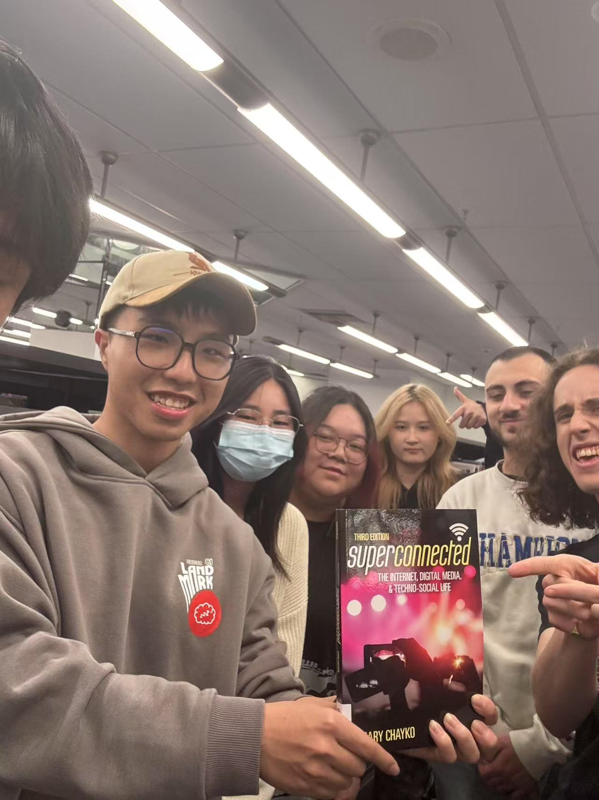
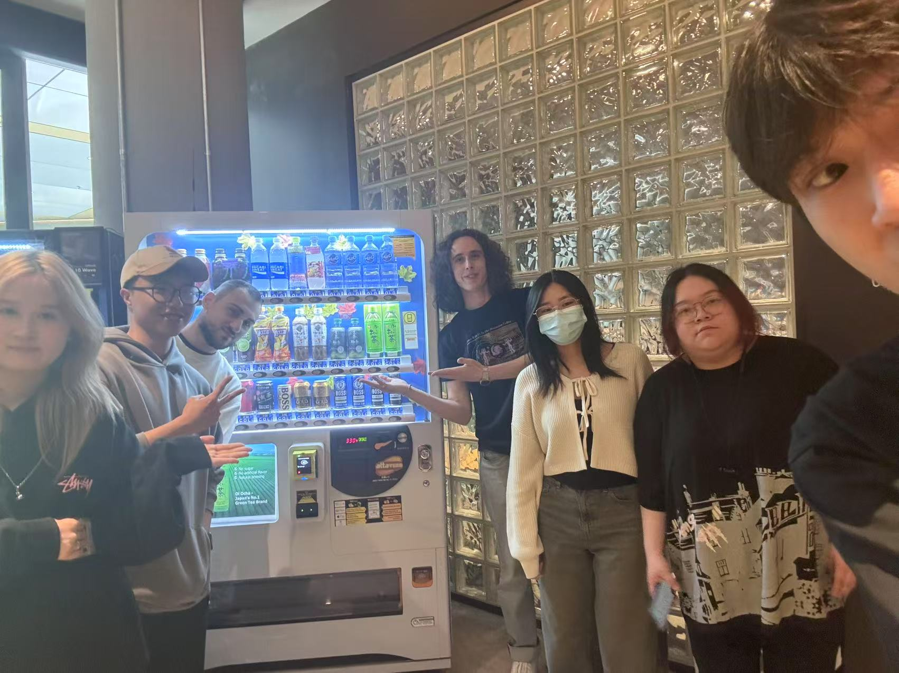
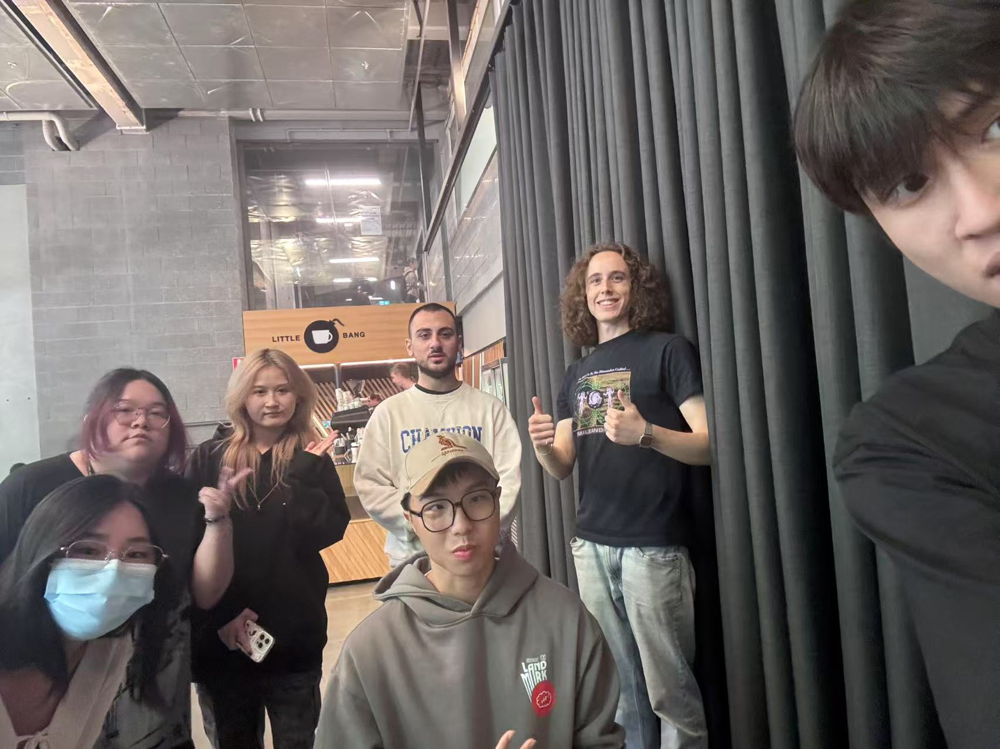
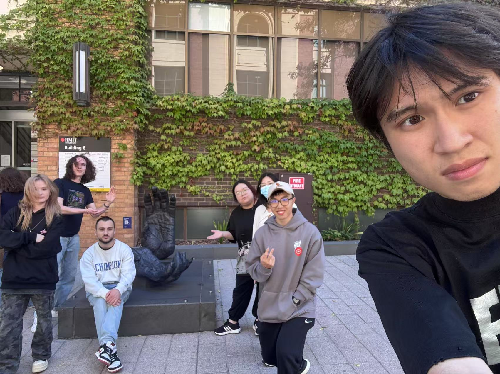
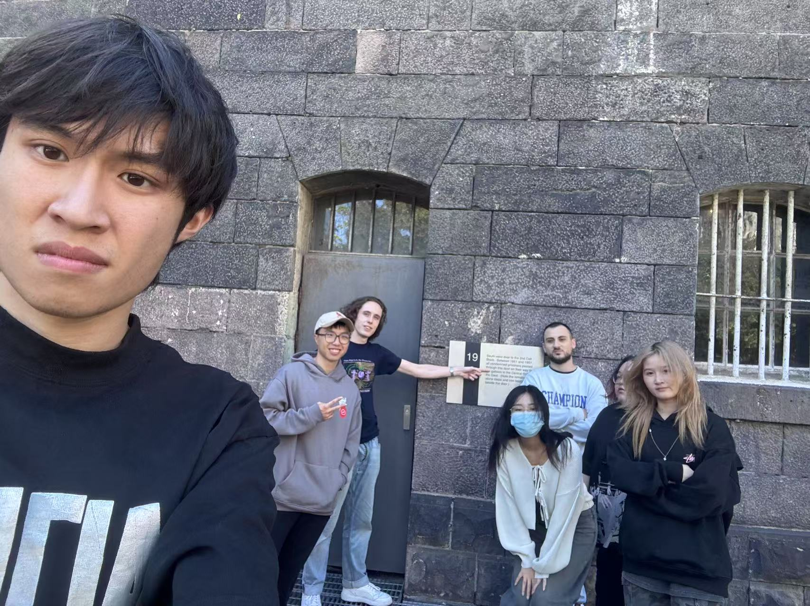
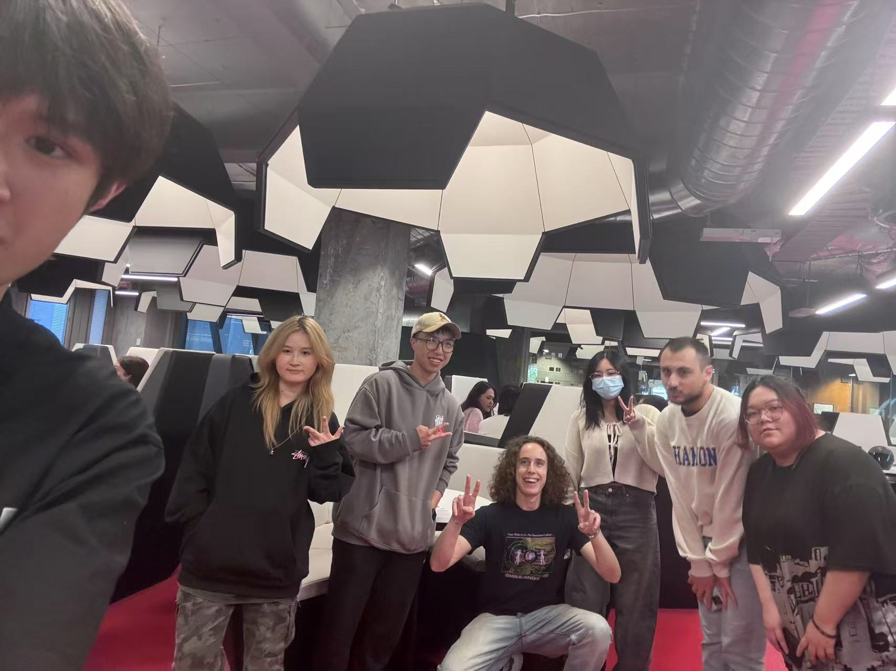
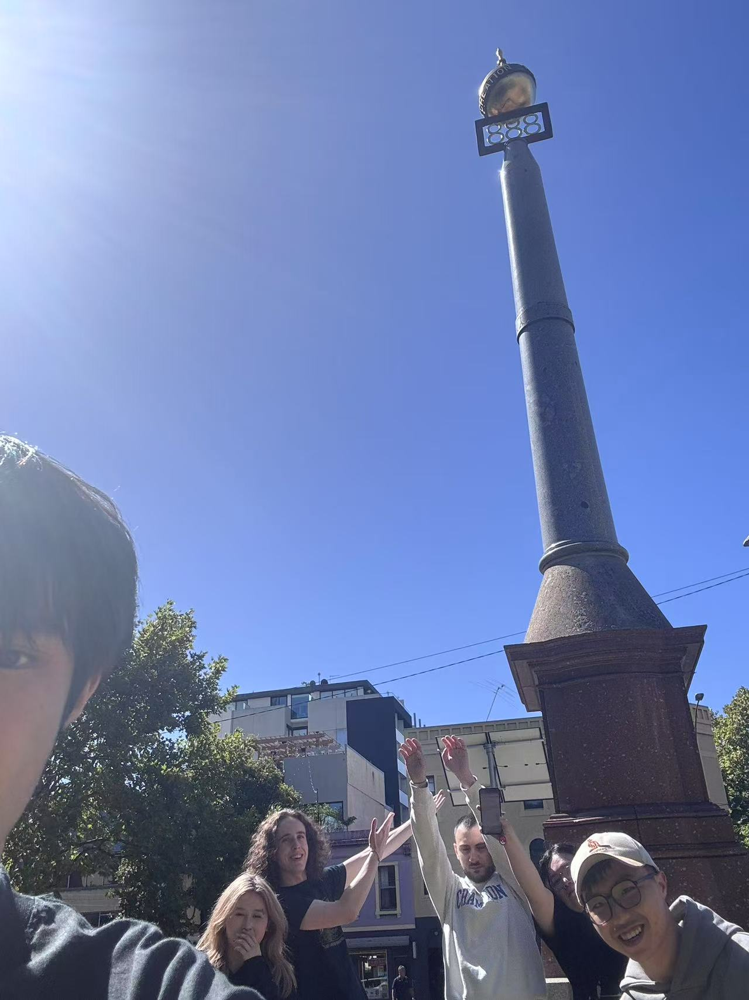
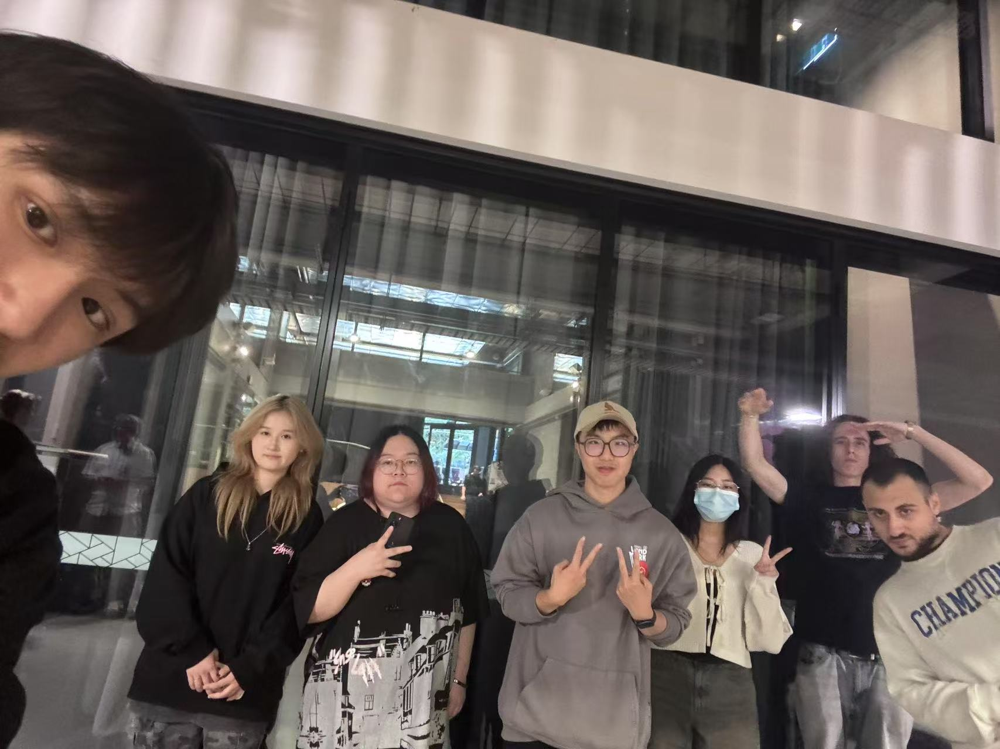

My name is Sihao Wang, English name is Benny. I come from China. I am studying this program because I am interested in computer code and using a lot of software. In the future I would like to work in a computer related field. This is the video of my apartment.

https://youtu.be/qeXdOzFQQEI

homework 2

https://youtu.be/_YB_5Zt4hsQ

# week 2

homework 1

I want to use a one shot technique in my viewscreen, but it should go through editing. I want the horror to come through in first person in my video screen as well as the camera shaking and the lighting changes. I'm going to edit it so that it looks like one person is walking from one side to the other, but it's actually many videos, so I'm going to have to pay attention to where my cell phone is while I'm filming and not let it be noticed that I'm controlling the lights so it feels like it's a real blackout and not an artifact of the power outage.

homework 2

The video I intend to make is a horror theme, I will be adding scary and spooky music, eerie breathing sounds as well as footsteps into my video. I plan to shoot in first person so that the viewer feels like they are a spectator as I move around the room with my cell phone and show the viewer what they want to see. I will show the story from the beginning of the blackout to the mysterious things that happen later on through the speed of the pace and changes in lighting.

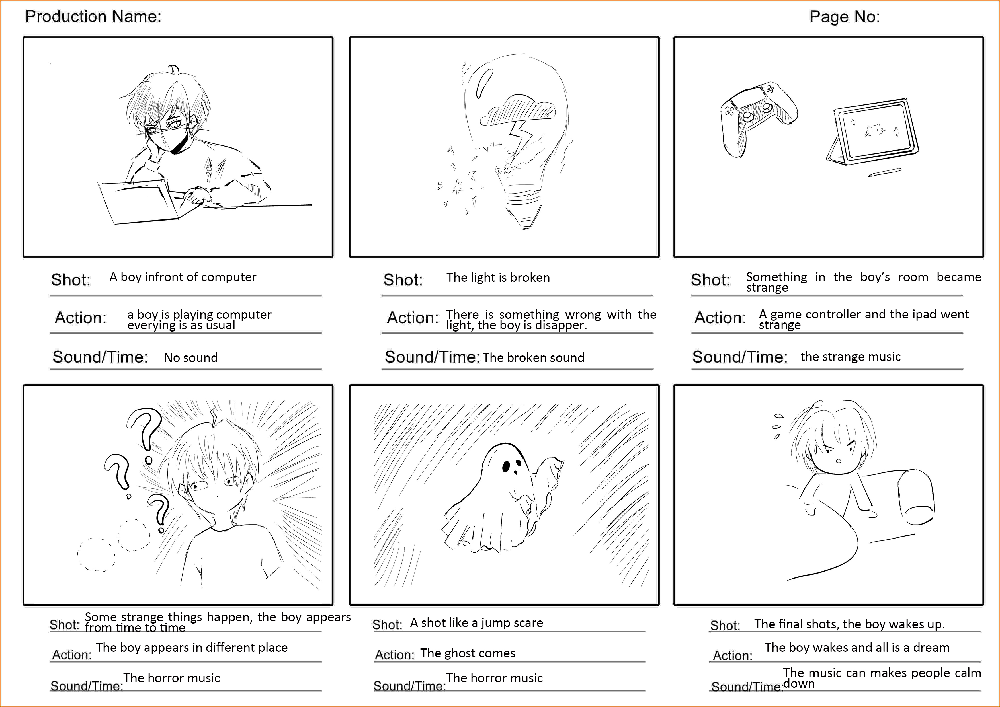

# week 3:

homework 1

I made this video by hiring someone to shoot some video of me in-house, I filmed in my apartment and I edited in some of the hobbies I like to play such as painting and using some camera equipment. I had my friend control the lighting changes and then shot a lot of video clips that I could link together and tried to play some scary music to complete my draft.
This is my draft: https://youtu.be/jItdJcLzYX8

